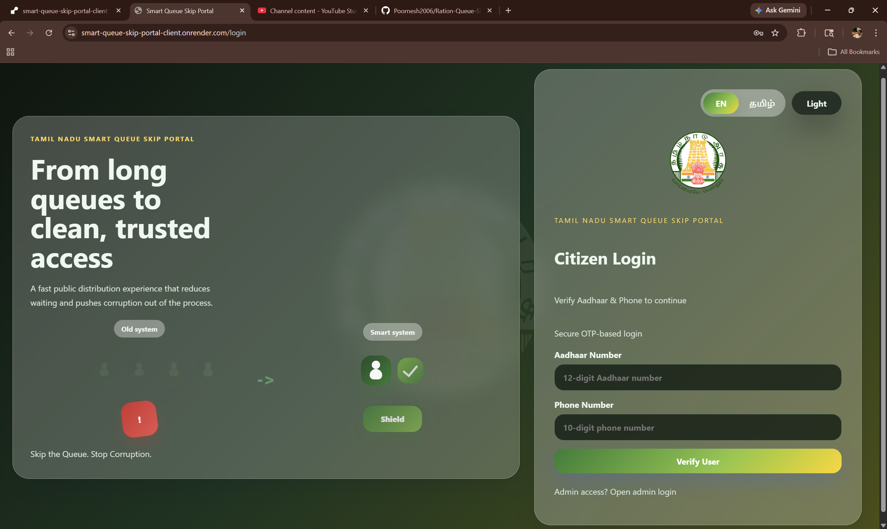
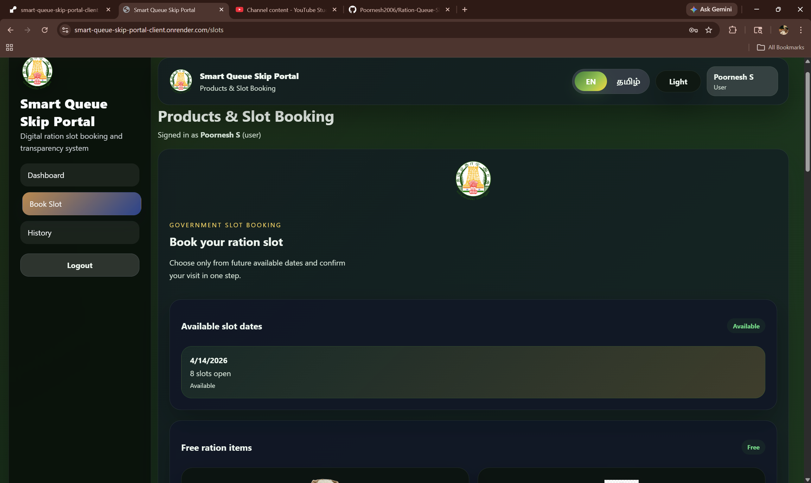
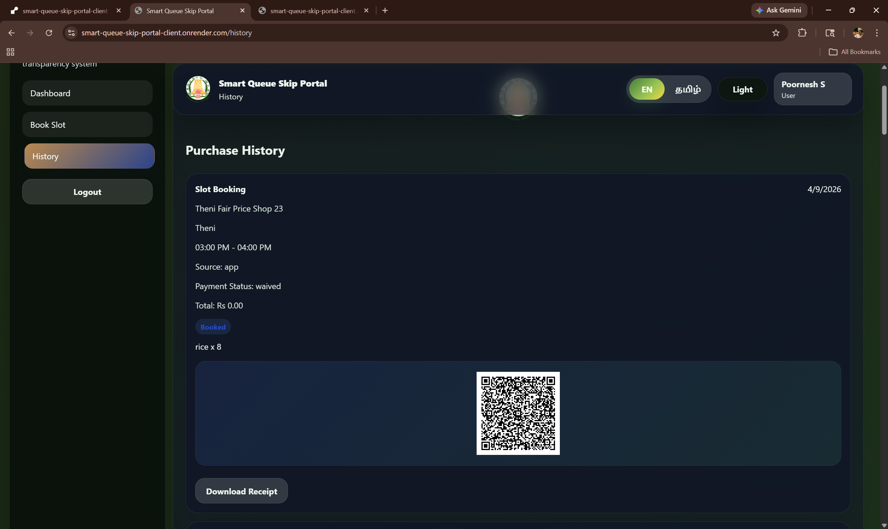
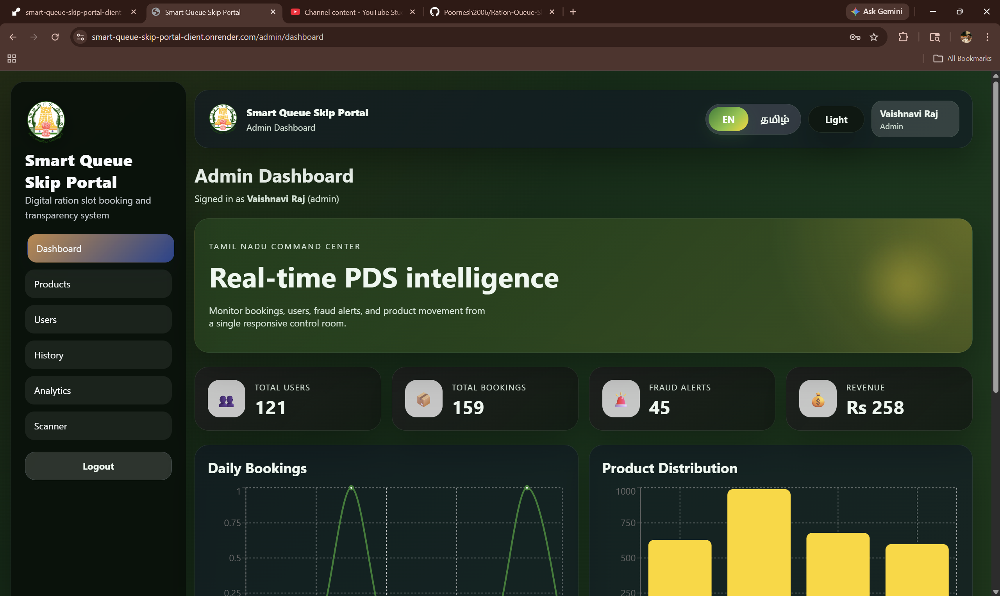

# Smart Queue Skip Portal

A modern ration shop management system for Tamil Nadu that reduces queue time, improves transparency, and protects families from fraud.

---

## Problem Statement

- Long queues at ration shops create delays and stress.
- Manual ration distribution allows corruption and unfair allocation.
- Beneficiaries lose time and confidence in public distribution.
- Lack of digital tracking makes fraud detection difficult.

---

## Solution Overview

Smart Queue Skip Portal delivers a digital ration shop experience for Tamil Nadu residents.

- Enables fast Aadhaar + OTP login
- Supports smart slot booking and product selection
- Generates QR codes for secure shop access
- Gives admins a real-time dashboard with fraud alerts
- Provides multi-language support in Tamil and English

---

## Key Features

- Aadhaar + OTP Login using Fast2SMS
- Optional Face Verification with AI support
- Smart Slot Booking System for ration pickup
- Ration Quantity Calculation by card type:
  - PHH
  - AAY
  - NPHH
- Product selection with per-item limits
- QR Code Generation & Verification for secure entry
- Admin QR Scanner for instant validation
- UPI Payment Integration (simulation / real)
- Receipt Download as PDF
- Voice Confirmation using optional AI
- Multi-language UI: Tamil and English
- Dark Mode support
- Booking History for users
- Admin Login/Logout History tracking
- Fraud Detection via activity pattern monitoring
- Admin Dashboard with analytics and charts

---

## Tech Stack

- Frontend:
  - HTML
  - Tailwind CSS
  - JavaScript
- Backend:
  - Node.js
  - Express.js
- Database:
  - MongoDB Atlas
- APIs:
  - Fast2SMS for OTP verification
  - UPI Payment API integration (simulation/real)

---

## System Architecture

- Frontend sends user actions to backend APIs
- Backend validates login, booking, and payments
- MongoDB stores users, bookings, shops, and transactions
- Admin dashboard reads analytics from the database
- QR codes and voice confirmation ensure secure access
- Fraud detection analyzes behavior and history

---

## How It Works

1. User selects language: Tamil or English
2. User logs in with Aadhaar + OTP
3. Optional face verification improves identity security
4. User selects ration slot and products
5. System calculates ration quantity by card type
6. Payment is completed via UPI
7. QR code is generated for shop check-in
8. Admin scans QR and verifies entry
9. Receipt is generated and downloadable as PDF
10. User booking history and admin activity logs are maintained

---

## Screenshots

---

## Demo Video

- Demo Video Link: `https://youtu.be/kopxHnHLxjQ`

---

## GitHub Repo Structure

- `client/` — Frontend application
  - `src/` — React components, pages, services, and styles
  - `public/` — Static assets and images
- `server/` — Backend application
  - `controllers/` — API logic
  - `models/` — Database schemas
  - `routes/` — Express routes
  - `middleware/` — Authentication and error handling
  - `services/` — Business logic and utilities
- `datasets/` — Example data files for testing
- `README.md` — Project overview and setup instructions

---

## Installation & Setup Guide

1. Clone the repository
   - `git clone https://github.com/your-username/smart-queue-skip-portal.git`
2. Install backend dependencies
   - `cd server`
   - `npm install`
3. Install frontend dependencies
   - `cd ../client`
   - `npm install`
4. Configure environment variables
5. Start backend server
   - `cd ../server`
   - `npm run dev`
6. Start frontend
   - `cd ../client`
   - `npm run dev`
7. Open the app in your browser

---

## Environment Variables

Create a `.env` file in `server/` with:

- `MONGO_URI` — MongoDB Atlas connection string
- `JWT_SECRET` — Secret key for authentication
- `FAST2SMS_API_KEY` — Fast2SMS API key
- `UPI_API_KEY` — UPI payment API key
- `FACE_VERIFICATION_KEY` — Optional AI face verification key
- `VOICE_API_KEY` — Optional voice confirmation API key

---

## Demo Accounts

- Admin login:
  - Admin ID (ration card): `TN-NIL-1001`
  - Password: `Admin@123`
- Citizen demo login:
  - Aadhaar Number: `234567890006`
  - Phone Number: `9000000006`
  - Login method: Aadhaar + OTP verification (no password required)

> Note: In demo mode, the OTP is displayed on the login screen when `SHOW_DEMO_OTP=true` or when the Fast2SMS API key is not configured.

---

## Future Improvements

- Add real Aadhaar authentication integration
- Support fully live UPI payments
- Expand AI fraud detection with machine learning
- Add SMS notifications for bookings and payment
- Support more local languages for wider accessibility
- Add offline mode for ration shops with intermittent connectivity

---

## Conclusion

Smart Queue Skip Portal modernizes Tamil Nadu ration distribution with a secure, fair, and transparent solution. This project reduces queue times, improves ration delivery, and strengthens government welfare systems through digital innovation.

- Real impact for ration card beneficiaries
- Scalable design for state-wide rollout
- Built for fairness, security, and efficiency
