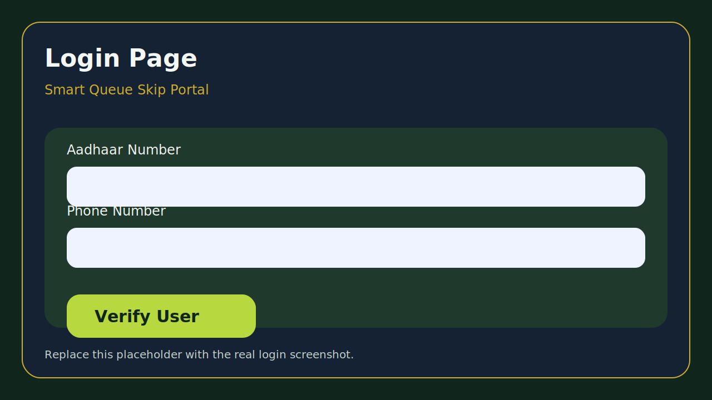
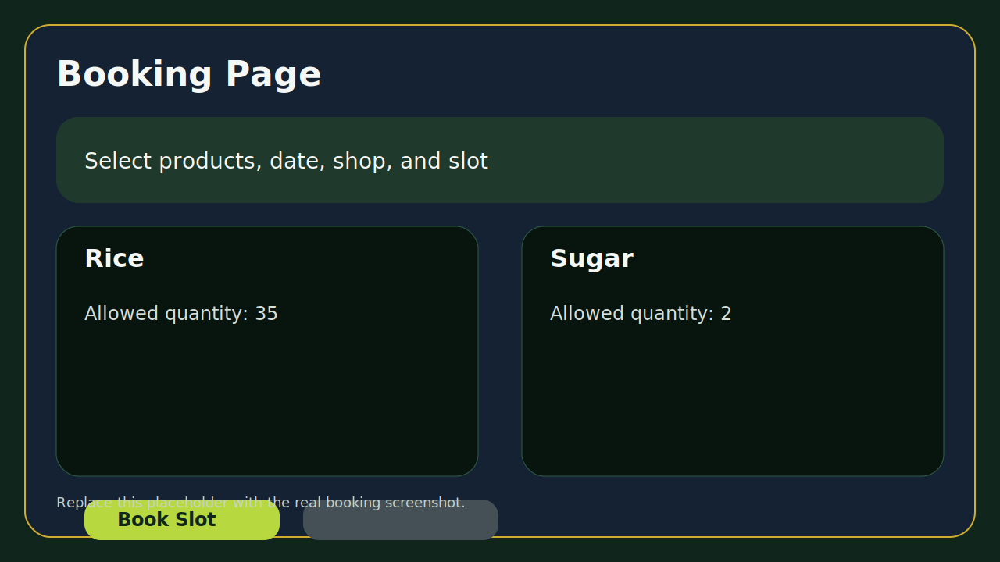
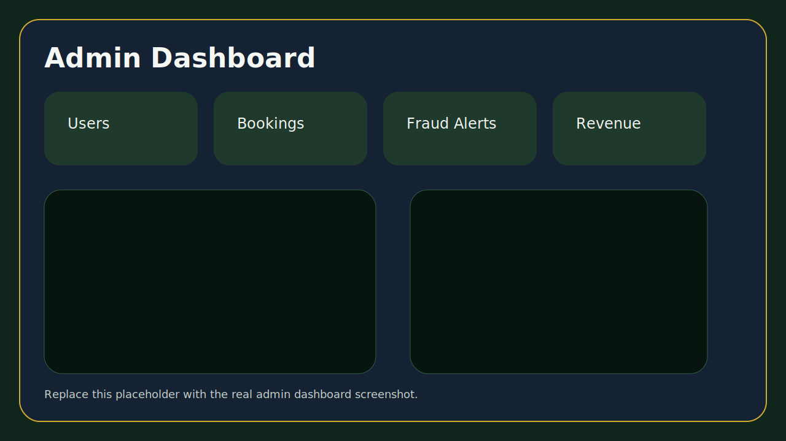
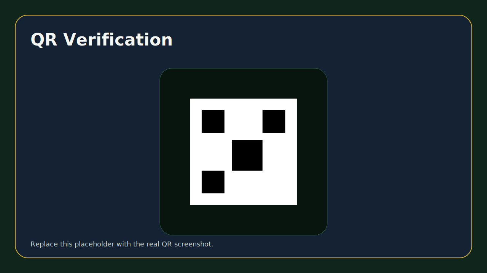

# Smart Queue Skip Portal

Digital solution to eliminate ration shop queues and prevent corruption.

## Overview

Smart Queue Skip Portal is a MERN stack solution designed for the Tamil Nadu Public Distribution System (PDS). It addresses common ground-level issues such as long waiting lines, manual favoritism, poor transparency, and limited tracking of ration distribution.

The platform digitizes the ration booking journey through Aadhaar and phone-based verification, slot scheduling, QR-based collection, payment handling for paid items, and an admin control panel for monitoring activity, fraud alerts, history, and stock movement.

## Problem Statement

Traditional ration shop workflows often suffer from:

- long queues and waiting time
- lack of transparent booking records
- manual corruption and favoritism
- weak tracking of collection history
- limited accountability in shop operations

## Solution

Smart Queue Skip Portal provides a digital booking and verification flow that helps citizens reserve a slot in advance, view entitlement-aware products, complete payment where required, and present a QR code for collection. Admins can monitor users, bookings, queue activity, and suspicious patterns through a centralized dashboard.

## Key Features

- OTP login using Aadhaar number and registered phone number
- citizen verification flow with secure login and session handling
- slot booking system with availability-aware scheduling
- free vs paid ration logic with entitlement-based quantity checks
- UPI-ready payment flow for paid items
- QR-based booking verification at collection time
- persistent booking history with QR visibility after refresh
- receipt generation and PDF download
- admin dashboard with analytics, monitoring, and history review
- fraud detection insights for suspicious patterns
- login, logout, booking, and purchase history tracking
- responsive UI optimized for mobile and desktop
- dark mode support

## Tech Stack

### Frontend

- React.js
- CSS-based responsive UI
- Framer Motion
- Recharts
- jsPDF

### Backend

- Node.js
- Express.js
- JWT authentication
- dotenv with ESM setup

### Database

- MongoDB
- Mongoose

### Integrations and Utilities

- QR Code generation
- Fast2SMS
- Render deployment support

## Screenshots

Replace these placeholder graphics with actual project screenshots before final submission if you want a judge-facing visual walkthrough.

### Login Page


### Booking Page


### Admin Dashboard


### QR Code


## Project Structure

```text
smart-queue-skip-portal/
├── client/
│   ├── public/
│   └── src/
├── datasets/
├── server/
│   ├── data/
│   └── src/
├── screenshots/
├── render.yaml
└── README.md
```

## Installation

### Clone the Repository

```bash
git clone <repo_link>
cd smart-queue-skip-portal
```

### Backend Setup

```bash
cd server
npm install
npm run seed
npm run dev
```

### Frontend Setup

```bash
cd client
npm install
npm run dev
```

### Run Full Project on Windows

```powershell
.\run-project.cmd
```

## Environment Variables

### Backend

Create `server/.env` and add:

```env
MONGO_URI=your_mongodb_connection_string
JWT_SECRET=your_long_random_secret
FAST2SMS_API_KEY=your_fast2sms_key
PORT=5000
JWT_EXPIRES_IN=7d
CORS_ORIGINS=http://localhost:5173,https://your-frontend-domain.onrender.com
FACE_VERIFICATION_ENABLED=false
FACE_MATCH_THRESHOLD=0.7
SHOW_DEMO_OTP=false
ENABLE_TRIAL_BOOKING=false
```

### Frontend

Create `client/.env` and add:

```env
VITE_API_BASE_URL=https://your-backend.onrender.com/api
VITE_FACE_VERIFICATION_ENABLED=false
```

## Deployment

### Backend Deployment on Render

- Service Type: Web Service
- Root Directory: `server`
- Build Command: `npm install`
- Start Command: `node server.js`

Add these environment variables in Render:

- `MONGO_URI`
- `JWT_SECRET`
- `FAST2SMS_API_KEY`
- `PORT`
- `CORS_ORIGINS`

### Frontend Deployment on Render or Vercel

- Root Directory: `client`
- Build Command: `npm install && npm run build`
- Publish Directory on Render Static Site: `dist`

Frontend environment variable:

- `VITE_API_BASE_URL=https://your-backend.onrender.com/api`

### Database Deployment

- MongoDB Atlas is recommended for production deployment

## Usage Guide

1. Open the citizen login page.
2. Enter Aadhaar number and registered phone number.
3. Verify OTP.
4. Choose available ration products within entitlement.
5. Select a booking date, shop, and slot.
6. Complete payment for paid items if required.
7. Receive booking QR code.
8. Show the QR code at the ration shop to collect ration.
9. Review booking and activity history from the history page.
10. Use the admin panel for monitoring, reports, and verification.

## Admin Module

The admin panel includes:

- dashboard overview cards
- analytics and charts
- product management
- user management
- activity history
- QR scanner and delivery marking
- fraud insights

## API Highlights

Main backend routes include:

- `/api/auth`
- `/api/users`
- `/api/shops`
- `/api/slots`
- `/api/bookings`
- `/api/book`
- `/api/history`
- `/api/admin`
- `/api/fraud`

## Demo Accounts

- Admin: `TN-NIL-1001` / `Admin@123`
- User: `TN-THA-1007` / `Password@123`

## Future Improvements

- face verification for stronger beneficiary authentication
- advanced AI-powered fraud detection
- native mobile application for citizens and shop operators
- multilingual voice guidance
- offline kiosk sync improvements

## Team

- Team Name: Hikers
- Leader: Poornesh S

## License

This project is licensed under the MIT License.

---

Built for transparent, efficient, and corruption-resistant ration distribution in Tamil Nadu.
